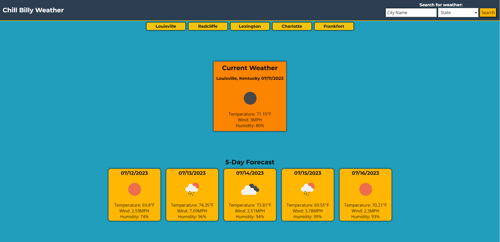

# City Weather Web App

## Description

This webpage is a City Weather Web App that allows users to quickly and easily retrieve current weather information for any desired location. By entering the name of a city, users can instantly obtain relevant weather data, including temperature, humidity, wind speed, and weather conditions. This was a homework challenge during bootcamp at UCB Ext. [Link to Deployed page](https://meanbean87.github.io/web-password-generator/).



## Technology Used

| Technology   | Badge                                                                  | Documentation                                                                            |
| ------------ | ---------------------------------------------------------------------- | ---------------------------------------------------------------------------------------- |
| HTML         |                     | [HTML Documentation](https://developer.mozilla.org/en-US/docs/Web/HTML)                  |
| CSS          |                         | [CSS Documentation](https://developer.mozilla.org/en-US/docs/Web/CSS)                    |
| JavaScript   |       | [JavaScript Documentation](https://developer.mozilla.org/en-US/docs/Web/JavaScript)      |
| Git          |               | [Git Documentation](https://git-scm.com/)                                                |
| Fuse.js      |            | [Fuse.js Documentation](https://fusejs.io/)                                              |
| Google Fonts |  | [Google Fonts Documentation](https://developers.google.com/fonts/docs/getting_started)    |
| jQuery       |              | [jQuery Documentation](https://api.jquery.com/)                                          |
| Day.js       |        | [Day.js Documentation](https://day.js.org/)                                              |

The City Weather Web App utilizes several technologies and libraries to enhance its functionality and user experience. The following technologies were used:

- **HTML**: The structure and layout of the webpage are created using HTML.
- **CSS**: The web app's styling and appearance are implemented using CSS.
- **JavaScript**: The functionality and interactivity of the web app are developed using JavaScript.
- **Git**: Version control and collaboration for the project are managed using Git.

In addition to these core technologies, the web app also utilizes the following libraries and APIs:

- **Fuse.js**: A lightweight fuzzy search library used to provide fast and accurate city search functionality.
- **Google Fonts**: The web app leverages the Google Fonts API to enhance the typography and visual aesthetics of the content.
- **jQuery**: A popular JavaScript library used for simplified DOM manipulation and event handling.
- **Day.js**: A minimalist JavaScript library for date and time manipulation, used to format and display time-related information in the web app.

The documentation links provided above can be referenced for more information on each technology, library, or API.
## JavaScript Example

```JavaScript
// Fetch function to get data from OpenWeatherMap API all of the above functions use this function
async function fetchData(url) {
  try {
    const response = await fetch(url);
    const data = await response.json();
    await new Promise((resolve) => setTimeout(resolve, 500));
    return data;
  } catch (error) {
    console.log(error);
    throw error;
  }
}
```

## Learning Points

1. **Event Handlers and JavaScript**: The City Weather Web App demonstrates the use of event handlers in JavaScript to create dynamic and interactive functionality. Event handlers allow us to respond to user actions, such as clicking a button or pressing the "Enter" key, and trigger specific actions or functions. In this case, the event handler is used to fetch weather data based on the user's input and dynamically render the weather information on the webpage.

2. **Dynamically Rendered Content**: By utilizing event handlers and JavaScript, the web app dynamically renders content on the webpage based on user interactions. When a user enters a city name and triggers the event handler, the JavaScript code sends a request to the OpenWeather API, retrieves the weather data for the specified city, and updates the HTML elements on the page with the relevant information. This approach allows for a seamless user experience, as the content is updated without requiring a full page reload.

3. **Data Types Returned by Event Handlers**: When using event handlers in JavaScript, it's essential to understand the data types returned by different events. For example, when handling a button click event, the event object may contain information such as the target element, event type, and other related data. By accessing and manipulating these data types, you can create customized functionality and tailor the behavior of your web app accordingly. Understanding the structure and properties of the data returned by event handlers is crucial for effective event handling and data manipulation.

4. **Asynchronous API Requests**: The City Weather Web App utilizes an external API, the OpenWeather API, to retrieve weather data. API requests are typically asynchronous, meaning that they don't block the execution of other code while waiting for a response. In JavaScript, this is commonly achieved using functions such as `fetch()` or `XMLHttpRequest()`. By using asynchronous API requests, the web app can continue executing other tasks while waiting for the API response, ensuring a smooth user experience.

5. **Error Handling and Validation**: When working with APIs, it's essential to implement proper error handling and validation mechanisms. In the City Weather Web App, error handling is crucial to handle scenarios where the API request fails or returns unexpected data. By implementing error handling, you can provide meaningful feedback to the user, such as displaying an error message or suggesting alternative actions. Additionally, input validation is important to ensure that the user enters valid and appropriate data, preventing potential errors or undesired behavior when making API requests.

6. **API Documentation and Integration**: Integrating APIs into your web applications requires understanding the documentation provided by the API provider. The OpenWeather API documentation, for example, outlines the available endpoints, parameters, and response formats. By studying the API documentation, you can learn how to construct API requests, handle responses, and utilize the provided data effectively. Familiarizing yourself with API documentation is a valuable skill when working with various APIs in your projects.

These learning points provide a foundation for understanding how to utilize event handlers in JavaScript, dynamically render content, work with different data types returned by event handlers, handle asynchronous API requests, implement error handling and validation, and utilize API documentation for integration purposes.


## Usage

To use the City Weather Web App, follow these steps:

1. Open the City Weather Web App in your web browser.

2. In the search bar at the top of the page, enter the name of the 
city and state for which you want to check the weather.

3. Press the "Enter" key or click the search button.

4. The web app will retrieve and display the current weather information for the specified city.

5. A button will appear of for the city that was previously searched.

To check the weather for another city, simply repeat steps 2-4.
## Author Info

Michael Mattingly

- GitHub: [Michael Mattingly](https://github.com/meanbean87)
- LinkedIn: [Michael Mattingly](https://www.linkedin.com/in/michael-mattingly-5580b1280/)

## Credits

- The Web Password Generator was created by [Michael Mattingly](https://github.com/meanbean87).
- Favicon owned by Michael Mattingly.
- **Fuse.js**: [Fuse.js-Homepage](https://www.fusejs.io/).
- **Google Fonts**: [GoogleFonts-Homepage](https://fonts.google.com/).
- **jQuery**: [jQuery-Homepage](https://jquery.com/).
- **Day.js**: [Day.js-Homepage](https://day.js.org/).
## License

This project is licensed under the [MIT License](LICENSE).
